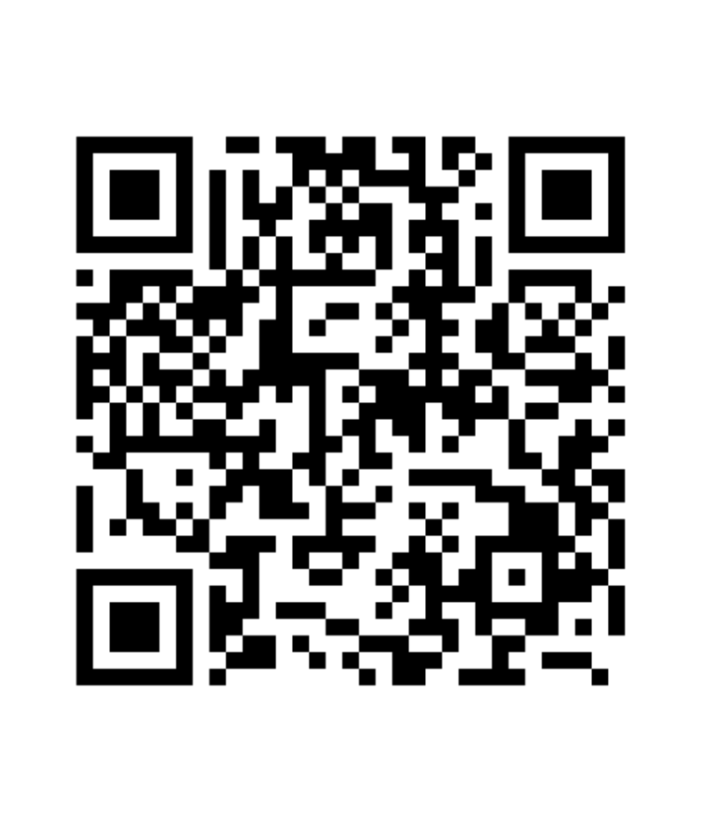

# TextOCR

<div align="center">

**A simple, elegant macOS menu bar utility for instant text recognition from screenshots.**

[](https://www.apple.com/macos/)
[](https://swift.org)
[](LICENSE)
[](https://github.com/lmquang/TextOCR/releases)

[Features](#features) • [Installation](#installation) • [Usage](#usage) • [Building](#building-from-source) • [Contributing](#contributing) • [Support](#support)

</div>

---

## Overview

TextOCR is a lightweight macOS menu bar application that captures screenshots, performs OCR text recognition using Apple Vision Framework, and automatically copies the extracted text to your clipboard. Perfect for:

- 📖 **Reading text from images** - Extract text from screenshots, PDFs, photos
- 📝 **Quick note-taking** - Capture text from videos, presentations, or web pages
- 🌍 **Language learning** - Copy foreign text for translation
- 💼 **Productivity boost** - Eliminate manual retyping
- ♿ **Accessibility** - Make non-selectable text accessible

Built with modern Swift/SwiftUI architecture and native macOS APIs, TextOCR is fast, secure, and privacy-focused with all processing done locally on your device.

## Features

### 🎯 Core Features

- **Instant OCR** - Accurate text recognition powered by Apple Vision Framework
- **Global Hotkey** - Trigger capture from anywhere with ⇧⌘2 (customizable)
- **Smart Selection** - Visual overlay with crosshair cursor and real-time dimensions
- **Auto Clipboard** - Extracted text automatically copied to clipboard
- **Menu Bar Only** - No Dock icon, stays out of your way
- **Native Integration** - Seamlessly integrates with macOS

### 🚀 Performance Features

- **Lightning Fast** - <300ms end-to-end latency (screenshot → clipboard)
- **Minimal Memory** - Uses <30MB of RAM when idle
- **Low CPU Usage** - <5% CPU during operation
- **Local Processing** - No internet required, completely offline

### 🎨 User Experience

- **Dark/Light Mode** - Automatically adapts to your system theme
- **Customizable Hotkeys** - Set your preferred keyboard shortcuts
- **Launch at Login** - Optional auto-start on system boot
- **Professional Selection UI** - Crosshair cursor with dimension labels
- **Clean Interface** - Simple, intuitive SwiftUI design

## Installation

### Download Pre-built Binary (Recommended)

1. Download the latest release from [Releases](https://github.com/lmquang/TextOCR/releases)
2. Unzip the downloaded file
3. Move `TextOCR.app` to your `/Applications` folder
4. Right-click and select "Open" (first time only, to bypass Gatekeeper)
5. The app will appear in your menu bar
6. Grant Screen Recording permission when prompted

### Building from Source

See [Building from Source](#building-from-source) section below.

## Usage

### Basic Usage

1. **Click the TextOCR icon** in your menu bar (document with viewfinder icon)
2. **Select "Capture Text"** or press **⇧⌘2** (Shift+Cmd+2)
3. **Click and drag** to select the screen region containing text
4. **Release** to capture - text will be automatically extracted and copied to clipboard
5. **Press ESC** to cancel selection
6. **Paste** (⌘V) the extracted text anywhere

### Keyboard Shortcuts

- **⇧⌘2**: Trigger text capture (customizable in Settings)
- **ESC**: Cancel current capture
- **Click menu bar icon**: Open TextOCR menu
- **Right-click menu icon**: Quick access to Quit

### Settings

Access settings by clicking "Settings..." in the menu bar menu:

- **Capture Hotkey**: Customize the global keyboard shortcut
- **Launch at Login**: Start TextOCR automatically when you log in
- **About**: Version information and credits

## Requirements

- **macOS 12.0 (Monterey)** or later
- **Apple Silicon** or **Intel** processor
- **Screen Recording permission** (granted on first use)
- **~30 MB** disk space
- **~30 MB** RAM when active

## Building from Source

### Prerequisites

- Xcode 15.0 or later
- macOS 12.0+ for development
- Command Line Tools: `xcode-select --install`

### Quick Build

```bash
# Clone the repository
git clone https://github.com/lmquang/TextOCR.git
cd TextOCR

# Build and install using the provided script
./scripts/build-app.sh
```

### Manual Build

```bash
# Build Release version
xcodebuild \
    -project TextOCR.xcodeproj \
    -scheme TextOCR \
    -configuration Release \
    -derivedDataPath build \
    clean build

# Copy to Applications
cp -R build/Build/Products/Release/TextOCR.app /Applications/
```

### Development Build

```bash
# Open in Xcode
open TextOCR.xcodeproj

# Press Cmd+R to build and run
```

### Package Dependencies

TextOCR uses Swift Package Manager for dependencies:
- [KeyboardShortcuts](https://github.com/sindresorhus/KeyboardShortcuts) - Global hotkey management

If package resolution fails, add manually in Xcode:
1. File → Add Package Dependencies
2. Add: `https://github.com/sindresorhus/KeyboardShortcuts`

For detailed build instructions, see [scripts/README.md](scripts/README.md).

## Architecture

TextOCR uses a modern service-based architecture:

```
┌─────────────────────────────────────┐
│   Platform Layer (AppKit)           │  Menu bar, lifecycle, hotkeys
├─────────────────────────────────────┤
│   Coordinator (Workflow)            │  Orchestrates capture flow
├─────────────────────────────────────┤
│   Services (Business Logic)         │  Screen capture, OCR, clipboard
└─────────────────────────────────────┘
```

**Key Components:**
- **ScreenCaptureService**: Dual-mode cursor system with fallback for system apps
- **OCRService**: Vision Framework wrapper for text recognition
- **ClipboardService**: NSPasteboard integration
- **CaptureCoordinator**: Workflow orchestration
- **MenuBarController**: UI and hotkey management

For architecture details, see [CLAUDE.md](CLAUDE.md).

## Security & Privacy

### Permissions

TextOCR requires the following permissions:
- **Screen Recording**: To capture screenshots (macOS 12.0+)

**Note:** TextOCR does NOT:
- Use the Mac App Store Sandbox (required to capture screenshots)
- Access the internet or phone home
- Collect any user data or analytics
- Store screenshots or extracted text (only clipboard)

### Code Signing & Notarization

TextOCR built from source:
- ✅ **Ad-hoc signed** (for local use)
- ❌ **Not notarized** (build yourself to verify security)
- ❌ **Not sandboxed** (required for ScreenCaptureKit)

Official releases will be:
- ✅ **Signed** with Developer ID
- ✅ **Notarized** by Apple
- ✅ **Hardened Runtime** enabled

### Privacy First

- All OCR processing happens **locally** on your device
- No data leaves your Mac
- No internet connection required
- No analytics or tracking
- Open source for full transparency

## Performance

TextOCR is designed for speed and efficiency:

- **End-to-end latency goal**: <300ms (screenshot → clipboard)
- **Comprehensive instrumentation**: Timing logs for each workflow step
- **Modern APIs**: ScreenCaptureKit for fast, efficient screen capture
- **Optimized OCR**: Vision Framework with balanced accuracy/speed settings

Performance metrics visible in Console.app during operation.

## FAQ

<details>
<summary><b>Why does macOS keep asking for Screen Recording permission?</b></summary>

This happens if the app is built without proper code signing. Make sure to build with at least ad-hoc signing:
```bash
CODE_SIGN_IDENTITY="-"
```
Do NOT use `CODE_SIGNING_REQUIRED=NO` as this prevents persistent permission grants.
</details>

<details>
<summary><b>The cursor doesn't change to crosshair. What should I do?</b></summary>

This can happen when triggering from certain system apps like System Settings. TextOCR uses a dual-mode cursor system:
- **Normal mode**: AppKit cursor rects when app can become active
- **Fallback mode**: Custom drawn crosshair when app cannot become active

The fallback mode automatically activates and shows a custom crosshair. Check Console.app logs for "Entering fallback mode" messages.
</details>

<details>
<summary><b>Can I change the global hotkey?</b></summary>

Yes! Open Settings from the menu bar and use the Keyboard Shortcut Recorder to set your preferred hotkey. The default is ⇧⌘2 (Shift+Cmd+2).
</details>

<details>
<summary><b>Does TextOCR work with the Mac App Store?</b></summary>

No. TextOCR cannot be distributed via the Mac App Store because it requires disabling the App Sandbox to use ScreenCaptureKit and access screen recording. This is an Apple limitation, not a TextOCR limitation.
</details>

<details>
<summary><b>Which languages does OCR support?</b></summary>

TextOCR uses Apple Vision Framework which supports 20+ languages including English, Chinese, Japanese, Korean, French, German, Spanish, and more. The framework automatically detects the language.
</details>

<details>
<summary><b>Why does macOS say the app is from an "unidentified developer"?</b></summary>

If you're building from source without signing, you'll see this warning. Right-click the app and select "Open" to bypass Gatekeeper. Official releases will be notarized by Apple.
</details>

<details>
<summary><b>How do I uninstall TextOCR?</b></summary>

Simply drag `TextOCR.app` from your Applications folder to the Trash. TextOCR stores minimal preferences in `~/Library/Preferences/` which you can also delete if desired.
</details>

## Troubleshooting

### "TextOCR.app is damaged and can't be opened"

This is a Gatekeeper quarantine issue. Fix it with:
```bash
xattr -cr /Applications/TextOCR.app
```

### TextOCR doesn't appear in menu bar

1. Check if `LSUIElement` is set to `true` in Info.plist
2. Restart your Mac
3. Check Console.app for error messages
4. Rebuild with `./scripts/build-app.sh`

### Screen Recording permission issues

1. Go to System Preferences → Privacy & Security → Privacy → Screen Recording
2. Ensure TextOCR is checked
3. If not listed, manually add TextOCR.app using the + button
4. Restart TextOCR after granting permission

### OCR not working or returning empty text

1. Ensure the selected region contains visible text
2. Try capturing a larger region
3. Check that text is not too small or blurry
4. Some stylized fonts may not be recognized accurately

### Build errors

**"No scheme named TextOCR"**
- Open `TextOCR.xcodeproj` in Xcode
- Product → Scheme → Manage Schemes
- Ensure "TextOCR" scheme is shared

**Package dependency errors (KeyboardShortcuts)**
- File → Add Package Dependencies in Xcode
- Add: `https://github.com/sindresorhus/KeyboardShortcuts`

For more troubleshooting, see [TROUBLESHOOTING.md](TROUBLESHOOTING.md) and [KNOWN_ISSUES.md](KNOWN_ISSUES.md).

## Contributing

Contributions are welcome! Here's how you can help:

### Development Guidelines

- Read [CLAUDE.md](CLAUDE.md) for architecture and coding conventions
- All services follow clean separation of concerns
- Use emoji logging conventions (📸🔤📋⚡)
- Write comprehensive tests for business logic
- Update documentation for new features

### Reporting Bugs

1. Check [existing issues](https://github.com/lmquang/TextOCR/issues) first
2. Create a [new issue](https://github.com/lmquang/TextOCR/issues/new) with:
   - macOS version
   - TextOCR version
   - Steps to reproduce
   - Expected vs actual behavior
   - Console logs (if applicable)

## Support

If you find TextOCR useful, consider supporting its development:

### ☕ Buy Me a Coffee

TextOCR is free and open source, built with love in my spare time. If it saves you time or makes your life easier, consider buying me a [coffee](https://www.buymeacoffee.com/quanglm)!

<div align="center">

| Buy Me a Coffee |  BTC |
| :---: | :---: |
|  |  |
| https://www.buymeacoffee.com/quanglm | bc1qgalaj8mafuqnf3qswzr7sjzk9tjlhad2jvez7e |

</div>

**Other Ways to Support:**
- ⭐ Star this repository
- 🐛 Report bugs and suggest features
- 📢 Share TextOCR with others
- 💻 Contribute code improvements
- 📝 Improve documentation

Every contribution, big or small, is greatly appreciated! 🙏

## License

TextOCR is released under the **MIT License**. See [LICENSE](LICENSE) for details.

## Acknowledgments

- Built with [Swift](https://swift.org) and [SwiftUI](https://developer.apple.com/xcode/swiftui/)
- Powered by [Apple Vision Framework](https://developer.apple.com/documentation/vision) for OCR
- Uses [ScreenCaptureKit](https://developer.apple.com/documentation/screencapturekit) for modern screen capture
- Global hotkeys via [KeyboardShortcuts](https://github.com/sindresorhus/KeyboardShortcuts) by Sindre Sorhus
- Menu bar integration with [AppKit](https://developer.apple.com/documentation/appkit)

## Contact

- **Author**: Quang Le
- **Email**: [quanglm.ops@gmail.com](mailto:quanglm.ops@gmail.com)
- **GitHub**: [@lmquang](https://github.com/lmquang)
- **Issues**: [GitHub Issues](https://github.com/lmquang/TextOCR/issues)

---

<div align="center">

**Made with ❤️ by [Quang Le](https://github.com/lmquang)**

</div>
